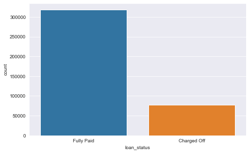
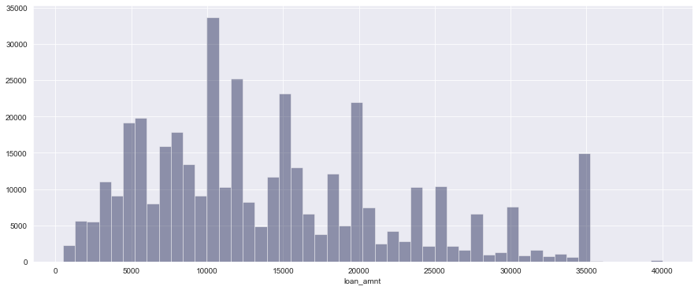
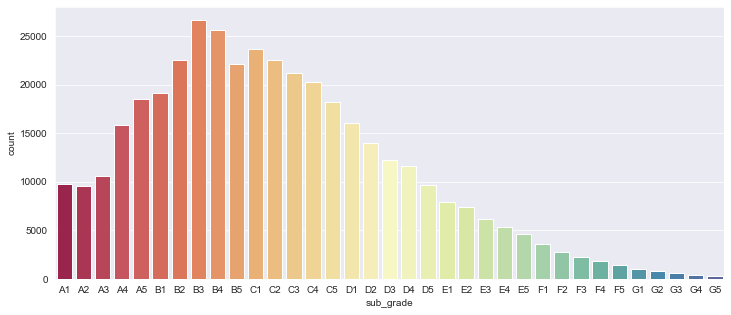
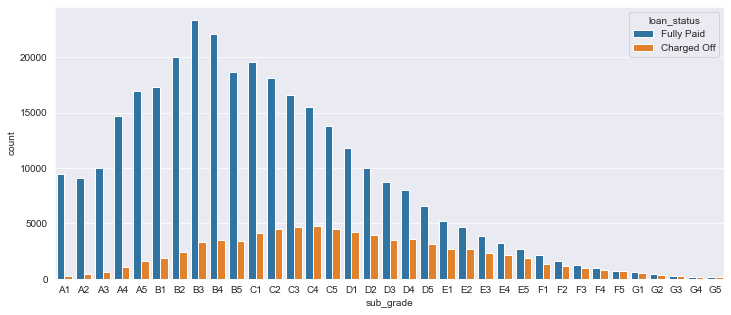
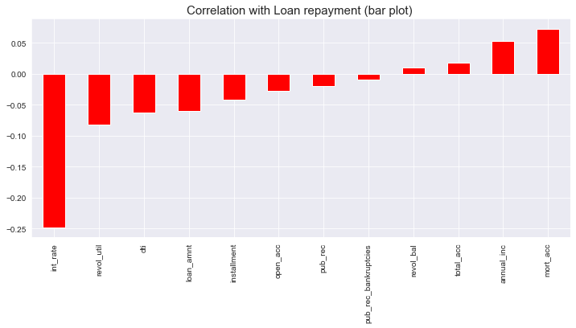
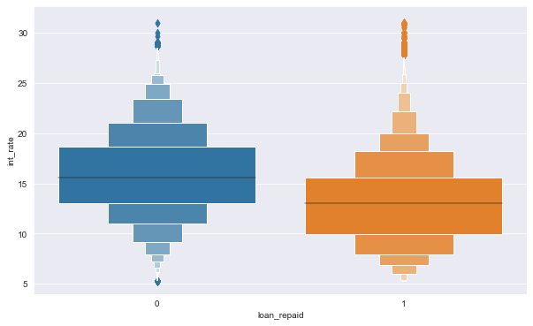

# Loan-Repayment-Prediction-Project

## Project Overview:

#### Intro

LendingClub is a US peer-to-peer lending company, headquartered in San Francisco, California.[3] It was the first peer-to-peer lender to register its offerings as securities with the Securities and Exchange Commission (SEC), and to offer loan trading on a secondary market. LendingClub is the world's largest peer-to-peer lending platform.

#### Our Goal

Given historical data on loans given out with information on whether or not the borrower defaulted (charge-off), we want to build a model that can predict wether or not a borrower will pay back their loan.

The "loan_status" column contains our label or it is the dependent variable(predicting class).

## Resources:

**Python version :** 3.7
**Packages Used:** pandas, numpy, matplotlib, seaborn, sklearn, tensorflow.

### Exploratory Data Analysis:

1. Used count plot to measure if the data is balanced or not.
   

2. Plotted distribution plots to explore the variation in loan amounts.

   
   
   Different sub grades in which the organization lended a loan.
   
   
   
   
   
   Correlation of the features with Loan repayment:
   
   
   
   Interest rates (box-plot):
   
   
   
3. These plots helped in gaining some meaningful insights regarding customer behaviours towards paying back the loan.

### Data Preprocessing and Feature Engineering:

1. Removed some of the features that have practically no impact of predicting if a burrower will pay back a loan.
2. Removed some null values that are very few in numbers(less than 0.5% of our data)
3. Created dummy variables for some data categories.
4. Did some Feature engineering on categorical data(like extracting the year from a date, zip code from address column).

### Model Building:

1. First splitted the data that was retrieved after preprocessing. The data was split into traing , validation and test sets.
   Used Stratified K-Fold as the data was imbalanced.
   
    **Stratified K-Folds cross-validator. Provides train/test indices to split data in train/test sets. This cross-validation object is a variation of KFold that returns stratified folds. The folds are made by preserving the percentage of samples for each class. Parameters n_splitsint, default=5.**
    
    **To know more about Stratified K fold, refer to [this](https://scikit-learn.org/stable/modules/generated/sklearn.model_selection.StratifiedKFold.html#:~:text=Stratified%20K%2DFolds%20cross%2Dvalidator,Parameters%20n_splitsint%2C%20default%3D5) documentation.**
    
2. Then inputs from all three data sets were sclaled using Standard Scaler.
4. Built a basic Artificial Neural Network(ANN) with 2 hidden layers. Used Softmax activation function for the output layer. Performed Hyperparameter tuning as well.

        model = Sequential()

        layer_size = inputs.shape[1]

        initializer = tf.keras.initializers.HeNormal()

        #1st Layer
        model.add(Dense(layer_size, activation='relu', kernel_initializer= initializer))
        model.add(Dropout(0.5))

        #2nd Layer
        model.add(Dense(100, activation='relu', kernel_initializer = initializer)),
        model.add(Dropout(0.5))

        #Output layer
        model.add(Dense(2,activation='softmax'))

        #Learning rate decay
        initial_rate = 0.1
        decay_steps = 1.0
        decay_rate = 0.3

        lr = tf.keras.optimizers.schedules.InverseTimeDecay(initial_rate, decay_steps, decay_rate)

        adam = Adam(learning_rate = lr)
        model.compile(loss = 'sparse_categorical_crossentropy', optimizer = adam)

5. Achieved an overall accuracy of 87%.
        
                 precision    recall  f1-score   support

                   0       0.68      0.62      0.65      7752
                   1       0.91      0.93      0.92     31769

            accuracy                           0.87     39521
           macro avg       0.79      0.77      0.78     39521
        weighted avg       0.86      0.87      0.87     39521

        
        

                
